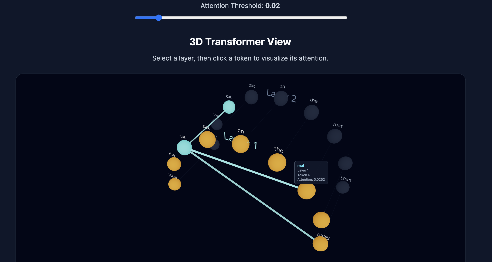
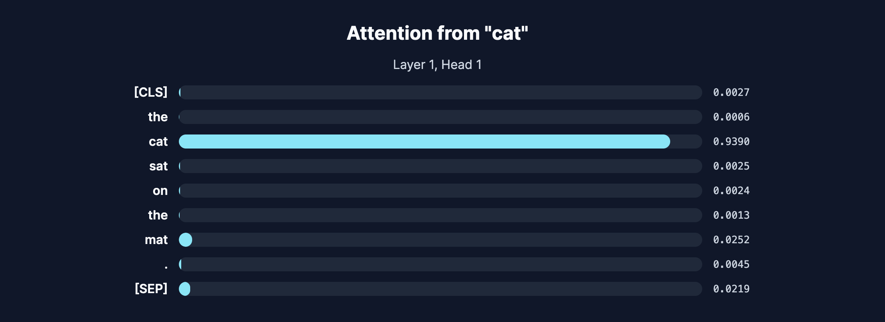

k# ModelLens

ModelLens is an interactive 3D visualization tool for exploring how transformer models distribute attention across tokens and layers.

It combines a Python backend with a React and Three.js frontend to turn transformer attention weights into an interactive visual experience.

## Features

- Analyze custom input text with a transformer model
- Visualize token attention in 3D
- Explore multiple transformer layers
- Switch between attention heads
- Click tokens to inspect their attention relationships
- Adjust attention threshold interactively
- Highlight token paths across layers
- Hover over tokens to view token, layer, and attention information
- View attention values as both 3D connections and 2D bars
- Loading and error handling for backend requests

## Architecture

```text
User Input
    |
    v
React Frontend
    |
    | JSON request
    v
FastAPI Backend
    |
    v
Hugging Face Transformer
    |
    v
PyTorch Attention Tensors
    |
    | JSON response
    v
React + Three.js Visualization
```

## Tech Stack

### Backend

- Python
- FastAPI
- PyTorch
- Hugging Face Transformers
- Uvicorn

### Frontend

- React
- Vite
- Three.js
- React Three Fiber
- Drei
- CSS

## How It Works

1. The user enters a sentence in the frontend.
2. React sends the text to the FastAPI backend.
3. The backend tokenizes the sentence and runs it through a transformer model.
4. Attention tensors are extracted from every available layer and attention head.
5. The backend converts the results into JSON.
6. React receives the token and attention data.
7. Three.js renders the transformer structure in interactive 3D.
8. The user can select layers, attention heads, tokens, and attention thresholds.

## Attention Visualization

Each token is represented as a 3D node.

Attention values determine the visual strength of connections between tokens.

Higher attention values are shown with stronger and thicker connections.

Users can:

- Select a transformer layer
- Select an attention head
- Click a token
- Inspect outgoing attention relationships
- Adjust the minimum attention threshold
- Hover over tokens for additional information

## Project Structure

```text
ModelLens/
├── backend/
│   ├── main.py
│   ├── attention_test.py
│   └── requirements.txt
│
├── frontend/
│   ├── src/
│   │   ├── App.jsx
│   │   ├── App.css
│   │   ├── index.css
│   │   └── main.jsx
│   ├── package.json
│   └── vite.config.js
│
├── README.md
├── LICENSE
└── .gitignore
```

## Running the Project

### Backend

Move into the backend directory:

```bash
cd backend
```

Create a virtual environment:

```bash
python3 -m venv venv
```

Activate it:

```bash
source venv/bin/activate
```

Install dependencies:

```bash
pip install -r requirements.txt
```

Start the FastAPI server:

```bash
uvicorn main:app --reload
```

The backend will run at:

```text
http://127.0.0.1:8000
```

### Frontend

Open another terminal and move into the frontend directory:

```bash
cd frontend
```

Install dependencies:

```bash
npm install
```

Start the development server:

```bash
npm run dev
```

The frontend will run at:

```text
http://localhost:5173
```

## API

### POST `/attention`

Example request:

```json
{
  "text": "The cat sat on the mat."
}
```

The response includes:

- Tokens
- Attention matrices
- Number of transformer layers
- Number of attention heads

## Screenshots

### 3D Attention Visualization



### Attention Weights



## Roadmap

- Improve 3D animations between transformer layers
- Add additional transformer models
- Add model selection
- Visualize embeddings
- Add attention-head comparison mode
- Improve long-sequence visualization
- Add deployment support

## License

This project is licensed under the MIT License.
